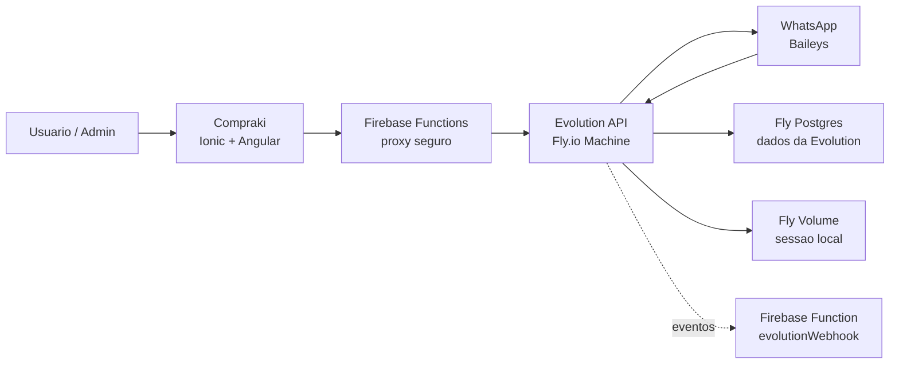
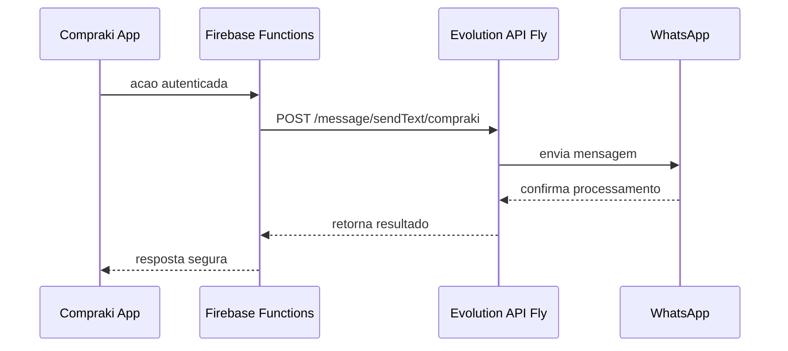

# Arquitetura da Evolution API no Compraki

Esta documentacao replica no Compraki a arquitetura usada no Instituto Gotland: a Evolution API roda separada do app principal, em um servico persistente, e o sistema chama esse servico somente pelo backend.

## Objetivo

A Evolution API precisa ficar sempre ativa para manter sessao do WhatsApp, gerar QR Code, receber eventos e persistir mensagens/contatos. Por isso ela nao deve rodar dentro do app Ionic/Angular nem dentro das Firebase Functions.

No Compraki, o app continua sendo a interface mobile/web e as Firebase Functions continuam protegendo a chave da Evolution. A Evolution roda como servico proprio no Fly.io.

## Resumo da arquitetura



## Componentes

### 1. App principal

Projeto: `compraki`

Responsabilidades:

- Interface do marketplace.
- Painel admin de WhatsApp.
- Chamadas autenticadas para as Firebase Functions.
- Nunca expor a chave da Evolution no frontend.

### 2. Firebase Functions

Responsabilidades:

- Validar usuario/admin pelo Firebase Auth.
- Chamar a Evolution API com `apikey` no backend.
- Enviar mensagens, listar chats, resolver midias e receber webhooks.
- Usar `EVOLUTION_DEFAULT_INSTANCE` como fallback quando a Evolution nao conseguir listar todas as instancias.
- Usar `WHATSAPP_SIGNUP_NOTIFY_PHONE` para enviar dados de novos cadastros ao WhatsApp administrativo.

Variaveis usadas:

```env
EVOLUTION_API_URL=https://instituto-gotland-evolution.fly.dev
EVOLUTION_API_KEY=sua-chave-secreta
EVOLUTION_DEFAULT_INSTANCE=compraki
WHATSAPP_SIGNUP_NOTIFY_PHONE=55DDDNUMERO
```

### 3. Evolution API

Servidor Fly usado:

```txt
https://instituto-gotland-evolution.fly.dev
```

Manager:

```txt
https://instituto-gotland-evolution.fly.dev/manager
```

Instancia compartilhada:

```txt
compraki
```

Imagem Docker:

```txt
atendai/evolution-api:v2.2.3
```

Responsabilidades:

- Manter a conexao WhatsApp via Baileys.
- Persistir instancias, contatos, chats e mensagens.
- Guardar sessao local em volume persistente.
- Ficar sempre ligada em uma Fly Machine.

## Decisoes replicadas do Gotland

- Evolution separada do app principal.
- Uma Fly Machine sempre ligada em Sao Paulo.
- Volume persistente para arquivos de sessao.
- Fly Postgres para dados internos da Evolution.
- Redis desligado em producao, usando cache local.
- Versao fixa do WhatsApp Web para evitar QR invalido.
- Chave da Evolution somente no backend.

## Fluxo de envio



## Webhooks

A Evolution pode chamar a Function `evolutionWebhook` para registrar eventos em `whatsappWebhookEvents`.

Se for configurar webhooks no Manager da Evolution, use a URL da Function publicada e, se habilitado, envie o header `x-evolution-webhook-secret`.

## Comandos uteis

Ver status do servico Evolution:

```powershell
fly status --app instituto-gotland-evolution
```

Ver logs:

```powershell
fly logs --app instituto-gotland-evolution
```

Publicar Functions do Compraki:

```powershell
firebase use compraki-mcu
firebase deploy --only functions
```

## Cuidados

Nunca commitar:

- `functions/.env`
- chave da Evolution
- connection string do Postgres
- respostas de QR Code
- arquivos de sessao da Evolution
